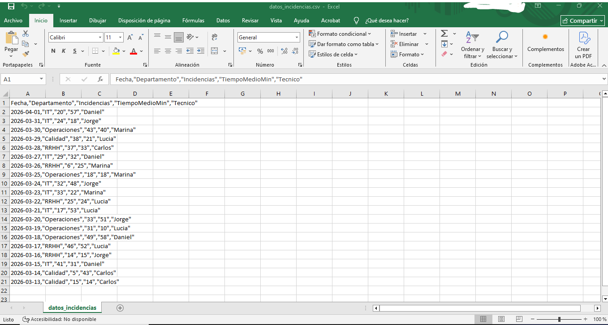
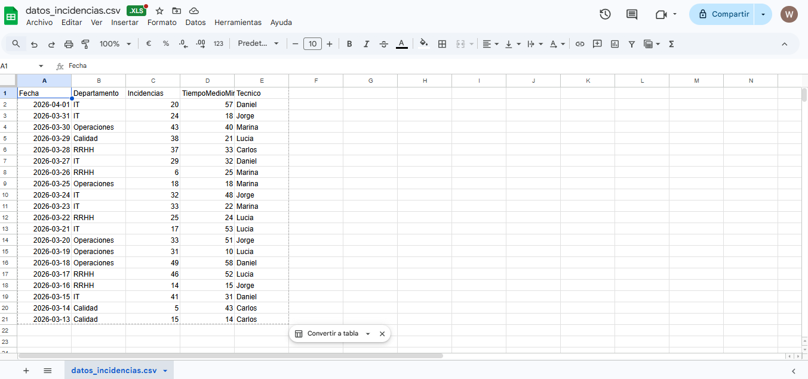
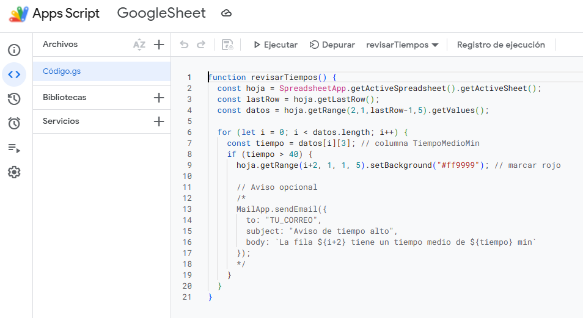
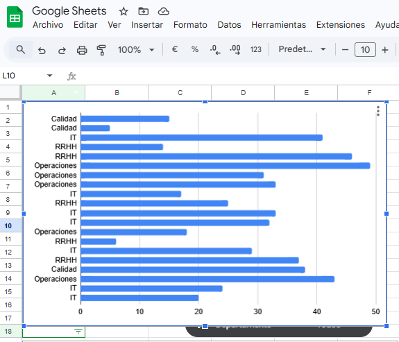
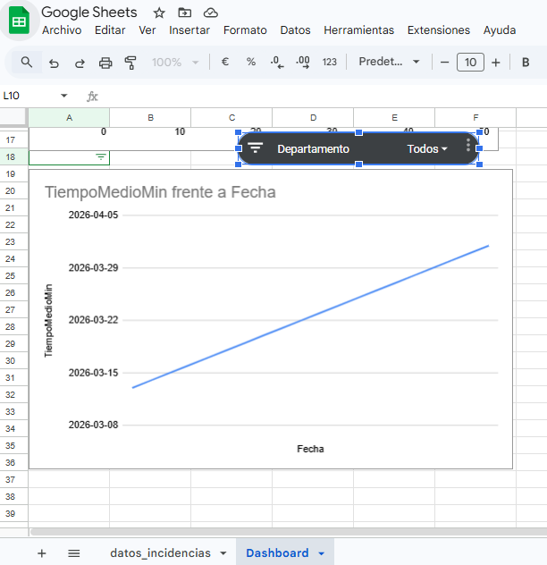
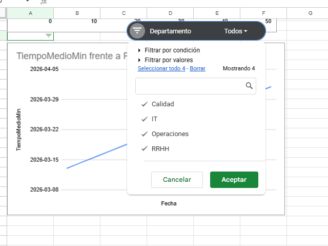

# Proyecto de Digitalización Junior – Flujo Completo de Trabajo
Generación de datos · Limpieza · Automatización · Dashboard

Este proyecto es una práctica completa de digitalización y automatización orientada a un puesto de Técnico Junior de Digitalización.
Simulo el flujo completo que podría hacerse en una empresa: generación de datos, limpieza, automatización con App Script y manipulación con PowerShell.
El objetivo es demostrar capacidad para trabajar con datos, automatizar procesos y documentar el trabajo de forma profesional.

## 🛠️ Tecnologías utilizadas

- **PowerShell** → generación y manipulación de datos en formato CSV
- **Google Sheets** → almacenamiento, limpieza y visualización de datos
- **Google Apps Script** → automatización de tareas (alertas, formato, validaciones)
- **CSV** → formato de datos estructurado
- **Markdown** → documentación del proyecto en GitHub
- **GitHub** → control de versiones y presentación profesional del trabajo 

---

## 1. Generación de Datos con PowerShell

En un entorno real, muchas empresas no tienen datos limpios o necesitan generar datos de prueba para validar procesos.
Por eso creé un script en PowerShell que genera un CSV con incidencias, tiempos medios y departamentos.

¿Qué demuestra este punto?
- Capacidad para automatizar tareas
- Conocimiento de PowerShell
- Creación de datos reproducibles
- Comprensión de estructuras CSV

📄 **Script completo:**  
[`generar_datos.ps1`](generar_datos.ps1)

### 📸 Vista previa del CSV generado

## 2. Limpieza y Análisis en Google Sheets
Una vez generado el CSV, lo importé en Google Sheets para simular el trabajo típico de un técnico que recibe datos sin procesar.
Aquí realicé:
- Limpieza de columnas
- Normalización de fechas
- Cálculos básicos y avanzados
- Preparación de rangos para gráficos
  
**Importación del CSV**  
Se cargó el archivo generado desde PowerShell.  

### 📸 Vista de los datos importados en Google Sheets

**Ordenación y estructura**
- Orden por fecha  
- Normalización de columnas  
- Formato de fecha ISO  

**Cálculos utilizados en Google Sheets**

[`excel_calculos.md`](excel_calculos.md)

**Preparación para Dashboard**
- Filtros automáticos  
- Rango limpio para gráficos  
- Columnas consistentes para eje X/Y  

---

## 3. Automatización con Google Apps Script

Para evitar tareas manuales repetitivas, añadí un script que detecta automáticamente valores críticos (tiempos > 40 min) y los resalta.
Esto simula automatizaciones reales como:
- Alertas
- Validaciones
- Formatos automáticos
- Procesos programados

📄 **Script completo:**  
[`apps_script.js`](apps_script.js)

### 📸 Vista del Apps Script

## 4. Dashboard en Google Sheets
Finalmente, construí un dashboard visual que permite:
- Filtrar por departamento
- Ver tendencias de tiempos medios
- Analizar carga de incidencias
- Detectar picos o problemas
  
**Gráfico de barras:**  
- Eje X → Departamento  
- Eje Y → Incidencias  

**Gráfico de líneas:**  
- Eje X → Fecha  
- Serie → TiempoMedioMin  

**Segmentador dinámico:**  
Control de filtro por departamento que afecta a todos los gráficos.

---

## 5. Conclusiones del proyecto

Este proyecto demuestra un flujo completo de digitalización aplicado a un entorno real: desde la generación de datos hasta su análisis y automatización.  
El resultado es un sistema sencillo pero funcional que permite:
- Generar datos de forma reproducible  
- Detectar incidencias críticas automáticamente  
- Visualizar información clave en un dashboard  
- Reducir tareas manuales mediante automatización  
El objetivo principal se cumple

